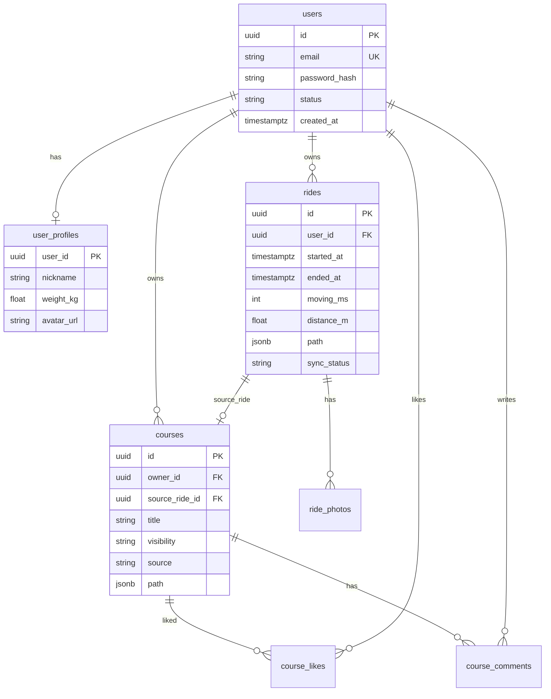

# 따릉따라 — DB 스키마 설계 v1.0

| 항목 | 내용 |
|------|------|
| 작성일 | 2026-08-05 |
| 대상 DB | **PostgreSQL 15+** (권장) |
| 목적 | 회원 · 주행 · 내 코스 · (추후) 공유/커뮤니티 |
| 상태 | **설계 초안** — 구현 전 합의용 |

---

## 1. 설계 원칙

### 1.1 DB에 넣는 것 / 안 넣는 것

| 넣음 (영속·소유·공유) | 안 넣음 (실시간·외부) |
|----------------------|----------------------|
| 회원·프로필·설정 | 따릉이 대여소 실시간 재고 |
| 주행 기록·경로·사진 메타 | 날씨 / 미세먼지 (조회 캐시만 선택) |
| 코스 (공식·유저·공유) | OSRM 길찾기 결과 전량 |
| 좋아요·댓글·팔로우 (2차) | 카카오 장소 검색 결과 |

대여소·날씨·길찾기는 지금처럼 **외부 API + 메모리 캐시**가 맞고,  
DB는 **“내 데이터 + 커뮤니티 콘텐츠”** 중심입니다.

### 1.2 단계

| 단계 | 범위 | 비고 |
|------|------|------|
| **P0** | `users`, `user_profiles`, `rides`, `ride_photos`, `courses` | 로그인 후 동기화 MVP |
| **P1** | 코스 공유·공개 목록, 좋아요 | 커뮤니티 탭 시작 |
| **P2** | 댓글·팔로우·신고·알림 | 본격 커뮤니티 |

### 1.3 ID 전략

- PK: **UUID** (`gen_random_uuid()`) — 클라이언트 오프라인 생성·동기화에 유리  
  (현재 로컬 ride `id`, course `course_id` 와 매핑 쉬움)
- 공개 숫자 ID가 필요하면 별도 `public_id BIGSERIAL` 추가 가능
- 로컬 `course_id`(100000+) 는 마이그레이션 시 `client_key` 로 보존

### 1.4 경로(path) 저장

- 1차: **JSONB** `[[lng, lat], ...]` — 구현 단순, 현재 FE와 동일  
- 2차(선택): PostGIS `geography(LineString)` — 공간 검색·근처 코스

포인트 전량(`points` with timestamp)은 용량이 커서:

- 목록용: 샘플 path (JSON, ≤ ~400점)
- 상세용: 필요 시 별도 `ride_track_points` 또는 압축 JSONB

### 1.5 사진

- DB에는 **메타 + 스토리지 키**만  
- 바이너리/data URL 은 **S3 / R2 / 로컬 디스크**  
- MVP 로컬 전용 단계에서는 사진 동기화 생략 가능

---

## 2. ER 개요 (P0 + P1)



---

## 3. 테이블 상세

### 3.1 `users` — 계정 (P0)

| 컬럼 | 타입 | 설명 |
|------|------|------|
| `id` | UUID PK | |
| `email` | CITEXT UNIQUE | 로그인 식별 (없으면 phone 확장) |
| `password_hash` | TEXT NULL | 소셜 전용이면 null |
| `provider` | TEXT NOT NULL DEFAULT 'local' | `local` \| `kakao` \| … |
| `provider_sub` | TEXT NULL | 소셜 subject |
| `status` | TEXT NOT NULL DEFAULT 'active' | `active` \| `disabled` \| `deleted` |
| `created_at` | TIMESTAMPTZ | |
| `updated_at` | TIMESTAMPTZ | |
| `last_login_at` | TIMESTAMPTZ NULL | |

**인덱스**

- UNIQUE `(provider, provider_sub)` WHERE provider_sub IS NOT NULL  
- UNIQUE `email` WHERE email IS NOT NULL  

---

### 3.2 `user_profiles` — 프로필·설정 (P0)

| 컬럼 | 타입 | 설명 |
|------|------|------|
| `user_id` | UUID PK FK → users | |
| `nickname` | TEXT NOT NULL | 표시명 (공유 시 authorLabel) |
| `weight_kg` | REAL NOT NULL DEFAULT 70 | 칼로리 추정 |
| `avatar_url` | TEXT NULL | |
| `bio` | TEXT NULL | 마이페이지 (나중) |
| `prefs` | JSONB NOT NULL DEFAULT '{}' | UI 설정 등 |
| `updated_at` | TIMESTAMPTZ | |

`prefs` 예:

```json
{ "default_route_mode": "personal", "map_show_stations": true }
```

---

### 3.3 `rides` — 완료 주행 기록 (P0)

현재 FE `RideRecord` 와 대응.

| 컬럼 | 타입 | 설명 |
|------|------|------|
| `id` | UUID PK | 클라에서 생성 가능 |
| `user_id` | UUID NOT NULL FK → users | |
| `client_key` | TEXT NULL | 로컬 동기화 키 (`ddareung_ride_…`) |
| `started_at` | TIMESTAMPTZ NOT NULL | |
| `ended_at` | TIMESTAMPTZ NOT NULL | |
| `moving_ms` | INT NOT NULL | 일시정지 제외 |
| `distance_m` | DOUBLE PRECISION NOT NULL | |
| `avg_speed_kmh` | REAL NOT NULL | |
| `max_speed_kmh` | REAL NOT NULL | |
| `calories_kcal` | REAL NOT NULL | |
| `path` | JSONB NOT NULL | `[[lng,lat],…]` 지도용 샘플 |
| `points` | JSONB NULL | `[{lat,lng,t,accuracy?},…]` 상세 (선택 저장) |
| `weather_snapshot` | JSONB NULL | `{temp_c, condition, score}` |
| `note` | TEXT NULL | |
| `source_course_id` | UUID NULL FK → courses | 추천/내 코스 따라 탄 경우 |
| `sync_status` | TEXT NOT NULL DEFAULT 'synced' | `synced` \| `pending` \| `conflict` |
| `created_at` | TIMESTAMPTZ | |
| `updated_at` | TIMESTAMPTZ | |
| `deleted_at` | TIMESTAMPTZ NULL | soft delete |

**인덱스**

- `(user_id, started_at DESC)`  
- UNIQUE `(user_id, client_key)` WHERE client_key IS NOT NULL  
- `(source_course_id)` WHERE NOT NULL  

**비고**

- 진행 중 세션(`ActiveRideSession`) 은 **서버 저장 안 함** (기기 로컬 유지)
- `points` 용량 크면 목록 API 에서 path 만 반환

---

### 3.4 `ride_photos` — 주행 사진 메타 (P0, 동기화는 선택)

| 컬럼 | 타입 | 설명 |
|------|------|------|
| `id` | UUID PK | |
| `ride_id` | UUID NOT NULL FK → rides ON DELETE CASCADE | |
| `storage_key` | TEXT NOT NULL | S3 key 등 |
| `content_type` | TEXT NOT NULL DEFAULT 'image/jpeg' | |
| `byte_size` | INT NULL | |
| `taken_at` | TIMESTAMPTZ NOT NULL | |
| `lat` | DOUBLE PRECISION NULL | |
| `lng` | DOUBLE PRECISION NULL | |
| `sort_order` | SMALLINT NOT NULL DEFAULT 0 | 1~5 |
| `created_at` | TIMESTAMPTZ | |

**제약**: 라이드당 최대 5장은 앱/서비스 레이어에서 강제 (CHECK 또는 트리거 선택)

---

### 3.5 `courses` — 코스 (P0 + 공유 필드 P1)

현재 FE `Course` / `LocalCourseRecord` 와 대응.  
공식 추천 + 유저 생성 + (나중) 커뮤니티를 **한 테이블**로 통합.

| 컬럼 | 타입 | 설명 |
|------|------|------|
| `id` | UUID PK | |
| `owner_id` | UUID NULL FK → users | 공식 코스는 NULL |
| `client_key` | TEXT NULL | 로컬 course_id 문자열 등 |
| `title` | TEXT NOT NULL | |
| `description` | TEXT NULL | |
| `distance_km` | REAL NOT NULL | |
| `duration_min` | INT NOT NULL | |
| `difficulty` | TEXT NOT NULL | `beginner` \| `intermediate` \| `advanced` |
| `tags` | TEXT[] NOT NULL DEFAULT '{}' | |
| `rating_avg` | REAL NULL | 집계 (나중) |
| `rating_count` | INT NOT NULL DEFAULT 0 | |
| `path` | JSONB NOT NULL | `[[lng,lat],…]` |
| **`source`** | TEXT NOT NULL | `official` \| `user` \| `community` |
| **`visibility`** | TEXT NOT NULL DEFAULT 'private' | `private` \| `shared` \| `public` |
| `source_ride_id` | UUID NULL FK → rides | 주행→코스 저장 시 |
| `share_slug` | TEXT NULL UNIQUE | 링크 공유용 (P1) |
| `published_at` | TIMESTAMPTZ NULL | public/shared 전환 시각 |
| `created_at` | TIMESTAMPTZ | |
| `updated_at` | TIMESTAMPTZ | |
| `deleted_at` | TIMESTAMPTZ NULL | |

**인덱스**

- `(owner_id, updated_at DESC)`  
- `(visibility, published_at DESC)` WHERE visibility IN ('public','shared') AND deleted_at IS NULL  
- GIN `tags`  
- UNIQUE `(owner_id, client_key)` WHERE client_key IS NOT NULL  

**가시성 규칙 (합의안)**

| visibility | 누가 보나 |
|------------|-----------|
| `private` | owner only |
| `shared` | 링크(`share_slug`) 아는 사람 (비로그인 허용 가능) |
| `public` | 커뮤니티 목록·검색 |

`source`:

| source | 의미 |
|--------|------|
| `official` | 운영/시드 (owner_id NULL) |
| `user` | 사용자가 만든 코스 (주행 저장 등) |
| `community` | (선택) 재게시·큐레이션 복사본 — 없어도 됨, public user 코스로 대체 가능 |

→ 구현 단순화를 위해 **`source=user` + `visibility=public` = 커뮤니티 노출** 로 가도 충분.

---

### 3.6 `course_likes` — 좋아요 (P1)

| 컬럼 | 타입 |
|------|------|
| `course_id` | UUID FK |
| `user_id` | UUID FK |
| `created_at` | TIMESTAMPTZ |
| PK | `(course_id, user_id)` |

---

### 3.7 `course_comments` — 댓글 (P2)

| 컬럼 | 타입 |
|------|------|
| `id` | UUID PK |
| `course_id` | UUID FK |
| `user_id` | UUID FK |
| `body` | TEXT NOT NULL |
| `created_at` | TIMESTAMPTZ |
| `deleted_at` | TIMESTAMPTZ NULL |

---

### 3.8 (보류) 넣지 않는 테이블

| 후보 | 이유 |
|------|------|
| `stations` | 서울 API 실시간, DB 복제 불필요 |
| `weather_cache` | 선택; Redis/메모리로 충분 |
| `route_cache` | OSRM 결과를 굳이 영속화하지 않음 |
| `active_ride_sessions` | 기기 로컬 |

---

## 4. 로컬 → 서버 매핑

| 현재 (브라우저) | 서버 테이블 |
|-----------------|-------------|
| `ddareung_ride_records_v1[]` | `rides` (+ `ride_photos`) |
| `ddareung_my_courses_v1[]` | `courses` (source=user, visibility=private) |
| `ddareung_ride_active_v1` | 동기화 안 함 |
| mock `MOCK_COURSES` | `courses` seed (source=official, visibility=public) |
| 체중 70kg 하드코드 | `user_profiles.weight_kg` |

**동기화 흐름 (권장)**

1. 로그인  
2. 로컬 pending 업로드 (`client_key` 기준 upsert)  
3. 서버 목록 pull → 로컬 캐시  
4. 충돌: `updated_at` 최신 우선 또는 서버 우선 (정책 한 줄로 고정)

---

## 5. DDL 초안 (P0)

```sql
-- 확장
CREATE EXTENSION IF NOT EXISTS pgcrypto;
CREATE EXTENSION IF NOT EXISTS citext;

-- users
CREATE TABLE users (
  id              UUID PRIMARY KEY DEFAULT gen_random_uuid(),
  email           CITEXT UNIQUE,
  password_hash   TEXT,
  provider        TEXT NOT NULL DEFAULT 'local',
  provider_sub    TEXT,
  status          TEXT NOT NULL DEFAULT 'active'
                  CHECK (status IN ('active', 'disabled', 'deleted')),
  created_at      TIMESTAMPTZ NOT NULL DEFAULT now(),
  updated_at      TIMESTAMPTZ NOT NULL DEFAULT now(),
  last_login_at   TIMESTAMPTZ,
  UNIQUE (provider, provider_sub)
);

CREATE TABLE user_profiles (
  user_id     UUID PRIMARY KEY REFERENCES users(id) ON DELETE CASCADE,
  nickname    TEXT NOT NULL,
  weight_kg   REAL NOT NULL DEFAULT 70 CHECK (weight_kg > 0 AND weight_kg < 300),
  avatar_url  TEXT,
  bio         TEXT,
  prefs       JSONB NOT NULL DEFAULT '{}'::jsonb,
  updated_at  TIMESTAMPTZ NOT NULL DEFAULT now()
);

CREATE TABLE rides (
  id                UUID PRIMARY KEY DEFAULT gen_random_uuid(),
  user_id           UUID NOT NULL REFERENCES users(id) ON DELETE CASCADE,
  client_key        TEXT,
  started_at        TIMESTAMPTZ NOT NULL,
  ended_at          TIMESTAMPTZ NOT NULL,
  moving_ms         INT NOT NULL CHECK (moving_ms >= 0),
  distance_m        DOUBLE PRECISION NOT NULL CHECK (distance_m >= 0),
  avg_speed_kmh     REAL NOT NULL DEFAULT 0,
  max_speed_kmh     REAL NOT NULL DEFAULT 0,
  calories_kcal     REAL NOT NULL DEFAULT 0,
  path              JSONB NOT NULL DEFAULT '[]'::jsonb,
  points            JSONB,
  weather_snapshot  JSONB,
  note              TEXT,
  source_course_id  UUID,  -- FK 는 courses 생성 후 추가
  sync_status       TEXT NOT NULL DEFAULT 'synced'
                    CHECK (sync_status IN ('synced', 'pending', 'conflict')),
  created_at        TIMESTAMPTZ NOT NULL DEFAULT now(),
  updated_at        TIMESTAMPTZ NOT NULL DEFAULT now(),
  deleted_at        TIMESTAMPTZ,
  UNIQUE (user_id, client_key)
);

CREATE TABLE ride_photos (
  id            UUID PRIMARY KEY DEFAULT gen_random_uuid(),
  ride_id       UUID NOT NULL REFERENCES rides(id) ON DELETE CASCADE,
  storage_key   TEXT NOT NULL,
  content_type  TEXT NOT NULL DEFAULT 'image/jpeg',
  byte_size     INT,
  taken_at      TIMESTAMPTZ NOT NULL DEFAULT now(),
  lat           DOUBLE PRECISION,
  lng           DOUBLE PRECISION,
  sort_order    SMALLINT NOT NULL DEFAULT 0,
  created_at    TIMESTAMPTZ NOT NULL DEFAULT now()
);

CREATE INDEX ride_photos_ride_id_idx ON ride_photos(ride_id);

CREATE TABLE courses (
  id               UUID PRIMARY KEY DEFAULT gen_random_uuid(),
  owner_id         UUID REFERENCES users(id) ON DELETE SET NULL,
  client_key       TEXT,
  title            TEXT NOT NULL,
  description      TEXT,
  distance_km      REAL NOT NULL CHECK (distance_km >= 0),
  duration_min     INT NOT NULL CHECK (duration_min >= 0),
  difficulty       TEXT NOT NULL
                   CHECK (difficulty IN ('beginner', 'intermediate', 'advanced')),
  tags             TEXT[] NOT NULL DEFAULT '{}',
  rating_avg       REAL,
  rating_count     INT NOT NULL DEFAULT 0,
  path             JSONB NOT NULL,
  source           TEXT NOT NULL
                   CHECK (source IN ('official', 'user', 'community')),
  visibility       TEXT NOT NULL DEFAULT 'private'
                   CHECK (visibility IN ('private', 'shared', 'public')),
  source_ride_id   UUID REFERENCES rides(id) ON DELETE SET NULL,
  share_slug       TEXT UNIQUE,
  published_at     TIMESTAMPTZ,
  created_at       TIMESTAMPTZ NOT NULL DEFAULT now(),
  updated_at       TIMESTAMPTZ NOT NULL DEFAULT now(),
  deleted_at       TIMESTAMPTZ,
  UNIQUE (owner_id, client_key)
);

ALTER TABLE rides
  ADD CONSTRAINT rides_source_course_fk
  FOREIGN KEY (source_course_id) REFERENCES courses(id) ON DELETE SET NULL;

CREATE INDEX rides_user_started_idx ON rides(user_id, started_at DESC)
  WHERE deleted_at IS NULL;
CREATE INDEX courses_owner_updated_idx ON courses(owner_id, updated_at DESC)
  WHERE deleted_at IS NULL;
CREATE INDEX courses_public_idx ON courses(visibility, published_at DESC)
  WHERE deleted_at IS NULL AND visibility IN ('public', 'shared');
CREATE INDEX courses_tags_gin ON courses USING GIN (tags);

-- P1
CREATE TABLE course_likes (
  course_id   UUID NOT NULL REFERENCES courses(id) ON DELETE CASCADE,
  user_id     UUID NOT NULL REFERENCES users(id) ON DELETE CASCADE,
  created_at  TIMESTAMPTZ NOT NULL DEFAULT now(),
  PRIMARY KEY (course_id, user_id)
);
```

---

## 6. API 초안 (스키마와 맞춤)

| Method | Path | 설명 | 단계 |
|--------|------|------|------|
| POST | `/api/auth/register` | 가입 | P0 |
| POST | `/api/auth/login` | JWT 발급 | P0 |
| GET/PATCH | `/api/me` | 프로필 | P0 |
| GET/POST | `/api/rides` | 내 주행 목록·업로드 | P0 |
| GET/PATCH/DELETE | `/api/rides/{id}` | 상세 | P0 |
| GET/POST | `/api/courses` | 공식+내코스 / 생성 | P0 |
| PATCH | `/api/courses/{id}` | 수정·visibility 변경 | P0→P1 |
| POST | `/api/courses/{id}/publish` | public/shared | P1 |
| GET | `/api/community/courses` | public 목록 | P1 |
| POST | `/api/courses/{id}/likes` | 좋아요 | P1 |

기존 mock:

- `GET /api/courses` — DB 도입 전: mock 유지  
- 도입 후: `official` public + (로그인 시) 내 private 병합

---

## 7. 결정이 필요한 포인트 (합의)

1. **인증**: 이메일+비번 먼저 vs 카카오 로그인 먼저  
2. **비회원**: 지금처럼 로컬만 유지할지, 게스트 UUID 발급할지  
3. **path 용량 상한**: 예) path ≤ 500점, points ≤ 2000점 또는 미저장  
4. **사진 동기화**: P0에서 제외할지 포함할지  
5. **공식 코스**: 시드 SQL vs 당분간 mock 병행  

**권장 기본값 (제안)**

1. 이메일+JWT (카카오는 2차)  
2. 비회원 = 로컬 only, 로그인 시 1회 머지 업로드  
3. path 샘플만 서버 저장, points 는 optional  
4. 사진 동기화는 P0.5 (스토리지 준비 후)  
5. 공식 코스 시드 6개를 `official`/`public` 로 INSERT  

---

## 8. 구현 순서 제안

1. 이 문서 합의 (위 5항목)  
2. Docker Compose: `postgres` + `DATABASE_URL`  
3. SQLAlchemy 모델 + Alembic 초기 마이그레이션 (P0 테이블)  
4. Auth + `/api/me`  
5. Rides CRUD + 로컬 동기화  
6. Courses CRUD + 공식 시드  
7. visibility publish + 커뮤니티 목록  

---

## 9. 현재 코드와의 관계

```
[지금]
localStorage rides/courses  →  동작 중
MOCK_COURSES                →  동작 중
DATABASE_URL                →  설정만, 미사용

[이 설계 이후]
PostgreSQL P0 테이블        →  회원 데이터 소스
localStorage                →  오프라인 캐시 / 비회원
mock                        →  시드로 흡수 또는 폴백
```

---

끝. 다음 액션: **§7 합의 항목** 정하면 DDL 확정 → 마이그레이션 코드 착수.
